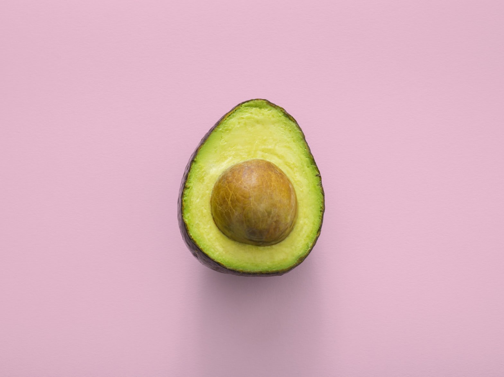
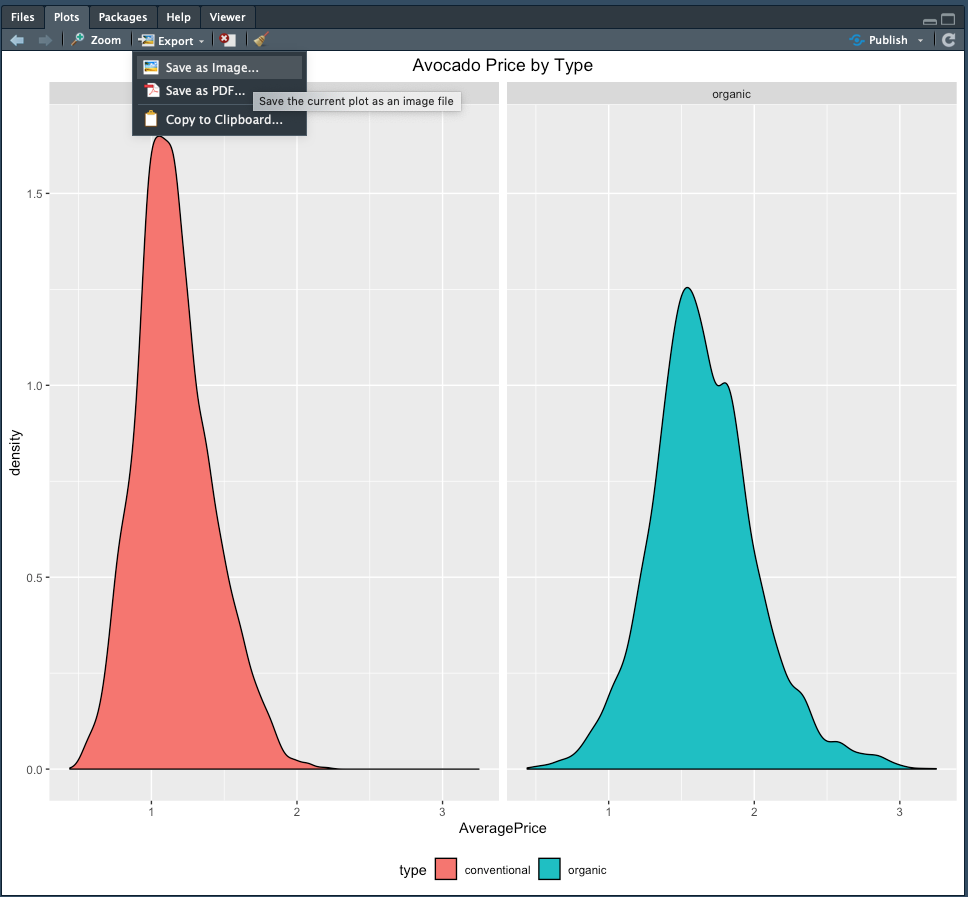

# Avocados Tutorial - Part 1

```{r, echo=FALSE, out.width="100%", fig.align="center"}
  
```

For this tutorial, we'll pretend we work for a supermarket chain interested in avocado pricing. Understanding price changes and the drivers behind those changes can help us forecast future shifts that enable us to stay ahead of the market and create appropriate pricing given the economic environment. 

**Goals of this tutorial**
 - Introduce `ggplot2` in more detail
 - Install and Load Packages 
 - Load and interact with large dataset
 - Practice `ggplot2` plots 
 
**Datasets used**
 - `avocado.csv`

## ggplot2 crash course

`ggplot2` is the most popular plotting package in R. It's regarded as one of the best visualization packages of any open-source programming language and has been refactored to work within other languages such as Python. The advantage of `ggplot2` is how optimized it is to work with big data. We can create `ggplots` for thousands of data points in less than a second. Customization options are also endless with `ggplot2`. `ggplot2` can create the following types of plots:

**1) Correlation**

* Scatterplot
* Scatterplot With Encircling
* Jitter Plot
* Counts Chart
* Bubble Plot
* Animated Bubble Plot
* Marginal Histogram / Boxplot
* Correlogram

**2) Deviation**

* Diverging Bars
* Diverging Lollipop Chart
* Diverging Dot Plot
* Area Chart

**3) Ranking**

* Ordered Bar Chart
* Lollipop Chart
* Dot Plot
* Slope Chart
* Dumbbell Plot

**4) Distribution**

* Histogram
* Density Plot
* Box Plot
* Dot + Box Plot
* Tufte Boxplot
* Violin Plot
* Population Pyramid

**5) Composition**

* Waffle Chart
* Pie Chart
* Treemap
* Bar Chart

**6) Change**

* Time Series Plots
  + From a Data Frame
  + Format to Monthly X Axis
  + Format to Yearly X Axis
  + From Long Data Format
  + From Wide Data Format
* Stacked Area Chart
* Calendar Heat Map
* Slope Chart
* Seasonal Plot

**7) Groups**

* Dendrogram
* Clusters

**8) Spatial**

* Open Street Map
* Google Road Map
* Google Hybrid Map

Additional information on these plots can be found at the following links:
* http://r-statistics.co/Top50-Ggplot2-Visualizations-MasterList-R-Code.html
* https://tutorials.iq.harvard.edu/R/Rgraphics/Rgraphics.html
* https://ggplot2.tidyverse.org/

All `ggplot` instances follow the same basic format: first calling `ggplot` and then a plot type. `ggplot` takes two arguments: the first is a dataset (a data.frame object) and the second is a call to aes(), where you assign variables in the dataset to components of the graph called aesthetics. The specific type of plot you'd like to make with it is the `ggplot2` function for the general type of plot you want: for example, a barplot is called `geom_bar` as we saw in the last example. Let's quickly explore these:

```{r}
var1 = seq(from=1, to=30, by=1)
var2 = rnorm(n=30, mean = 10, sd = 1)
df <- data.frame(x = var1, y = var2)
head(df)
```

Now that we have a data frame with variables `var1` and `var2`, we can create a ggplot. Let's start by creating the background of our ggplot by using the first calling `ggplot`. 

```{r}
library(ggplot2)
ggplot(data = df, aes(x = var1, y = y))
```

The data argument is declared as our `df` data.frame. Our x axis and y axis are specified by the `var1` and `var2` variables within the `df` dataframe. R understands what `var1` and `var2` are because it assumes the aesthetics are *variables within* the `data` dataframe. Now we can plot a `ggplot2` instance using this.

```{r}
ggplot(df, aes(x = var1, y = var2)) + geom_point()
```

`ggplot` is *unique* in that it's components are *added* via the `+` sign. So we created the `ggplot` instance with `ggplot(df, aes(x = var1, y = var2))` and added the plotting component with `+ geom_point()`. The `geom` in `geom_point` stands for geometry. All geometrical plots in `ggplot2` begin with `geom`. 

```{r}
ggplot(df, aes(x = var1, y = var2)) + geom_line()
```

Within the plot type we can specify additional arguments to enhance the plot in a way we'd like.

```{r}
ggplot(df, aes(x = var1, y = var2)) +
  geom_line(color = "darkblue", linetype = 2, size = 1)
```

We can also add linear regression lines to our plots easily

```{r}
ggplot(df, aes(x = var1, y = var2)) +
  geom_smooth(method = "lm")
```

We can have multiple geometry plots on one `ggplot` instance...

```{r}
ggplot(df, aes(x = var1, y = var2)) +
  geom_smooth() +
  geom_point()
```

Histograms can be done within 1 line.

```{r}
ggplot(df, aes(x = var2)) +
  geom_histogram()
```

Density plots are easy too!

```{r}
ggplot(df, aes(x = var2)) +
  geom_density()
```

Now that we've gone through some example plots with `ggplot2`, let's use `ggplot2` to plot some real data!


## Load the avocados Dataset

First we'll load in the packages and the avocados dataset. 

```{r}
# first let's load in the packages we need
library(data.table)
library(dplyr)
library(ggplot2)
library(stringr)
library(DT)
library(tidyr)
library(corrplot)
library(leaflet)
library(lubridate)

# now let's load in our dataset using read.csv
avocado_df <- read.csv("datasets/avocado.csv")

```

```{r include=FALSE}
options(tibble.width = Inf)
```

Let's check out what the avocados dataframe (`avocado_df`) looks like.

```{r, echo=FALSE}
datatable(head(avocado_df,30), style="default", class="table-condensed", options = list(dom = 'tp',scrollX = TRUE))
```

```{r}
# understand what classes R recognizes our data as
class(avocado_df)

# what about the class of the `type` variable within the avocado_df data frame? 
class(avocado_df$type)

```

## Exploring the Dataset

* Is there null data ?
* What are various columns ?
* How many years are in this dataset?
* How many regions and what are they ?
* Can we create revenue and profit variables?

**Is there null data?**

Null data is a feature of most datasets. In R, null data is classified as `NA`, or Not Available. If there is null data in a dataset, you'll see an `NA` in the dataset. For reference, a blank cell in Microsoft Excel would be regarded as `NA` when read in R. 

```{r}
sum(is.na(avocado_df$AveragePrice) == TRUE)
```

To find out if there are any null data points we use the `is.na()` function. This prints out a `logical` (aka True or False) for each cell. It prints `FALSE` if there is data and `TRUE` if the data is `NA`. In the code above, we tell R to `sum()` the number of times the `is.na` reports `TRUE` for the `AveragePrice` variable. We see that the return is 0 here, thus telling us that there are no `NA` data points in this dataset. 

** What are the various column names** 

With most things in R, there are multiple ways to answer the same question. 

```{r}
names(avocado_df)
colnames(avocado_df)
```

**What years are in this dataset?**
Use the `unique` function which returns a list of each character string, number, or whatever is in a `vector` or `list`. 
```{r}
unique(avocado_df$year)
```

**What regions are in this dataset?**

```{r}
unique(avocado_df$region)
```

**How many regions are in this dataset?**

```{r}
length(unique(avocado_df$region))
```

** What types of avocados are in this dataset **

```{r}
# Remember, we can query information about a variable using avocado_df$type or avocado_df['type']
unique(avocado_df['type'])
```

There are 2 types of avocados in this dataset - conventional and organic. Let's use `ggplot2` to plot a density plot of the avocados based on the type. 

```{r}
ggplot(avocado_df, aes(x=AveragePrice, fill=type)) + geom_density() 
```

Let's expand this a little further and create 2 `geom_density` plots within 1 window.

```{r}
ggplot(avocado_df, aes(x=AveragePrice, fill=type)) + geom_density() + facet_wrap(~type)
```

In this plot, we declare our `ggplot` instance, set the type of plot as a `geom_density` plot, and then use a `facet_wrap` to create plots from each `type` of avocado. This allows you to produce plots subset by variables in your data. If we had additional types of avocados, the `facet_wrap` function would automatically add those to the plot as well! The `~` is necessary in `~type` for `facet_wrap` to be satisfied.  

Let's expand on this plot a little further by adding the following adjustments to `theme` and `labs`. `theme` is the `ggplot2` theme you use for your `ggplot`. `labs` is the label function. With these two functions, we can declare changes to the x and y labels, title, legend position, etc. 

```{r}
ggplot(avocado_df, aes(x=AveragePrice, fill=type)) + geom_density() + facet_wrap(~type) + 
theme(plot.title=element_text(hjust=0.5), legend.position="bottom") + labs(title="Avocado Price by Type")
```

Great job! Now let's save this image to share with our team later on! We can do this by navigating to the `Plot` window (bottom right quadrant), selecting `Export` and `Save As Image`. 

```{r, echo=FALSE, out.width="100%", fig.align="center"}
  
```

## Expanding the dataset

Before we expand on this dataset, let's get rid of unnecessary columns that aren't useful to us. We do this by declaring the variable equal to `NULL`

```{r}
avocado_df$X = NULL
avocado_df$X4046 = NULL
avocado_df$X4225 = NULL
avocado_df$X4770 = NULL
avocado_df$XLarge.Bags = NULL
```

** Calculating Revenue and Profit **

  Revenue = TotalVolume * AveragePrice
  
  Profit - Assume that conventional fetches 15% profit of revenue while organic fetchs 45% of revenue

Let's calculate the revenue and add it to our dataframe

```{r}
# we simply multiply the two columns together
av_revenue = avocado_df$Total.Volume * avocado_df$AveragePrice

# to add our av_revenue vector to the dataframe, add it in like so
avocado_df['revenue'] = av_revenue
```

Now let's add a blank **profit** column and populate it based on our conditions above. 

```{r}
# add the blank column - remember we can use = or <- for object/variable declaration
avocado_df$profit <- NA
```

Now, we need to create 1 profit variable that encompasses 2 conditions. The first is that the **conventional** avocado has a 15% profit, while the **organic** avocado has a 45% profit. 

```{r}
avocado_df$type[1]

## use the logical operator to test that avocado_df$type[1] is equal to 'conventional'
avocado_df$type[1] == 'conventional'
```

We see that our test value (row 1 of the `avocado_df$type[1]`) is **conventional** and our logical test shows this. Now let's apply this method above to the `profit` variable we want to add to the dataset. We'll do so using the `ifelse()` function. 

```{r}
# let's use our "is equal to"
avocado_df$profit = ifelse(test = avocado_df$type == 'conventional', yes = (avocado_df$revenue * 0.15), no = (avocado_df$revenue * 0.45))
```

`ifelse()` takes 3 arguments - `test`, `yes` and `no`. Our test is whether the `avocado_df$type` is `conventional`. If it is indeed `conventional` we multiply our revenue by 0.15 to calculate the profit. Conversely if it is not `conventional`, then it must be organic and thus we multiply our revenue by 0.45 to calculate the profit. This is the beauty of R in motion. The `ifelse()` function is automatically rolling through **every row** and running the same test. Notice how fast this runs. Keep in mind that this dataset is ~18,000 rows long. 

** Let's take a look at our updated dataframe **

```{r, echo=FALSE}
datatable(head(avocado_df,30), style="default", class="table-condensed", options = list(dom = 'tp',scrollX = TRUE))
```

It looks great! Let's save all of our hard work as a new, separate csv file. We do this using the `write.csv()` function. 

```{r, eval = FALSE}
# x is the dataframe, and the file is the path AND the new filename we want to name our CSV file
write.csv(x = avocado_df, file = "/Users/james/Downloads/updated_avocado.csv")
```

## Recap

  - `ggplot2` is a powerful visualization package
  - `ggplot2` takes two objects to create a plot: First, a `ggplot` instance that creates the x & y axes and second, `geom_line` or whatever type of plot you want to create. `ggplot` is *unique* in that it's components are *added* via the `+` sign
  - Adding and removing columns in our `data.frame` can be done easily
  - We can save our `data.frame` to a csv file


## Avocado Assignment 

Complete the following coding problems and submit the resulting plots and CSV file. 

  HINT: Creating a separate Dataframe of the Albany region is done like so...

  `albany = avocado_df[avocado_df$region == 'Albany',]`

1) The profit for California avocados is 5% higher for **both** conventional and organic avocados. Make an adjustment to the `profit` variable of the dataframe that reflects the situation where if a rows region is `California`, the profit is 10% higher for those rows. Save this updated CSV. 

2) Create a `geom_density() ggplot` of the California types of avocados vs. profit. Save this image. 

3) Create a new dataframe subselecting the **'TotalUS'** region. First, plot a `geom_point` plot of x=Date, y=revenue, and with a facet wrap of the `type` of avocados. Second, plot a `geom_point` plot of x=Date, y=profit, and with a facet wrap of the `type` of avocados. Save these plots. 


**Your final products should look like this...**


```{r, echo = FALSE, fig.align="center"}
avocado_df$profit = ifelse(test = avocado_df$region == 'California', yes = avocado_df$profit * 1.05, no = avocado_df$profit * 1)

cali = avocado_df[avocado_df$region == 'California',]

datatable(head(cali,30), style="default", class="table-condensed", options = list(dom = 'tp',scrollX = TRUE))


ggplot(cali, aes(x=profit,  fill=type)) + geom_density() + facet_wrap(~type) + 
theme(plot.title=element_text(hjust=0.5), legend.position="bottom") + labs(title="Profit by avocado Type")

us = avocado_df[avocado_df$region == 'TotalUS',]

ggplot(us, aes(x=Date,  y=revenue)) + geom_point() + facet_wrap(~type) + 
theme(plot.title=element_text(hjust=0.5), legend.position="bottom") + labs(title="Revenue by avocado Type")

ggplot(us, aes(x=Date,  y=profit)) + geom_point() + facet_wrap(~type) + 
theme(plot.title=element_text(hjust=0.5), legend.position="bottom") + labs(title="Profit by avocado Type")
```

We'll explore these plots in more detail moving forward - we'll also clean them up a bit for a nice final product but for now this is great!

