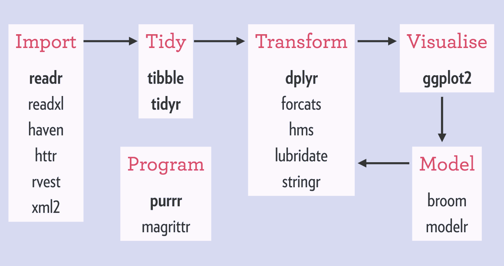

# Avocados Tutorial - Part 2

```{r, echo=FALSE, out.width="100%", fig.align="center"}
knitr::include_graphics("images/avocado2.jpeg")  
```

We're going to continue our exploration of the avocados dataset for this tutorial. We're going to introduce `dplyr`, an R package with tremendous power that was built with Excel users in mind. 

**Goals of this tutorial**
 - Introduce Tidyverse and `dplyr` 
 - Practice exploring the avocados dataset using `dplyr`
 - Create more advanced `ggplot` plots
 - Investigate Avocado price trends
 
**Datasets used**
 - `avocado.csv`
 
## Tidyverse : dplyr crash course

The tidyverse is a collection of R packages for data manipulation, exploration and visualization that share a common design philosophy. The advantages of the tidyverse include consistent functions, workflow coverage, a path to data science education, a parsimonious approach to the development of data science tools, and the possibility of greater productivity. The tidyverse packages can be used in conjunction with any R packages but they are designed to work seamlessly with each other. The basic set of packages are:

```{r, echo=FALSE, out.width="100%", fig.align="center", fig.cap="Image courtesy of https://rviews.rstudio.com/2017/06/08/what-is-the-tidyverse/)"}
  
```

As we see from the image, we're already familiar with the visualization package of tidyverse - `ggplot2` ! As stated in the introductory material, there are thousands of packages in R, many of which solve the same problem. Tidyverse is just a specific set of packages that are enhanced to work together, so from here on we're going to stick to this set of R packages for consistency. Tidyverse data science forms what we refer to as `tidy datasets`, which just refers to specific datasets in tidy format. You can use any R package with `tidy datasets` and can also use tidyverse packages on a regular `data.frame`. When you use the set of tidyverse packages together, however, you have some *extra* functionality which will come in handy. You can read more about tidyverse in [this R blog post](https://rviews.rstudio.com/2017/06/08/what-is-the-tidyverse/)

### Dplyr

`dplyr` is an R package for data manipulation, providing a consistent set of functions that help you solve the most common data manipulation challenges. `dplyr` is part of the Tidyverse family of packages, thus allowing a user to create tidy datasets. "Tidy datasets are easy to manipulate, model and visualise, and have a specific structure: each variable is a column, each observation is a row, and each type of observational unit is a table." [(From Wickham, H. (2014): Tidy Data)](https://www.jstatsoft.org/article/view/v059i10))

  - `select()` picks variables based on their names.
  - `filter()` picks cases based on their values.
  - `mutate()` adds new variables that are functions of existing variables
  - `summarise()` reduces multiple values down to a single summary.
  - `arrange()` changes the ordering of the rows.

These all combine naturally with `group_by()` which allows you to perform any operation by group.

### Exploring Dplyr

Let's begin by loading our packages and opening the avocados dataset back up. 

```{r}
# first let's load in the packages we need
library(data.table)
library(dplyr)
library(ggplot2)
library(stringr)
library(DT)
library(tidyr)
library(corrplot)
library(leaflet)
library(lubridate)
library(cowplot)


# now let's load in our dataset using read.csv
avocado_df <- read.csv("datasets/avocado.csv")

```

```{r, echo=FALSE}
datatable(head(avocado_df,10), style="default", class="table-condensed", options = list(dom = 'tp',scrollX = TRUE))
```


Now, let's use `dplyr` with this dataset. First, let's select a subset of this dataset using the `select()` function 

```{r}
# subselect the Average Price, Total Volume, and type from our original dataset
select_df <- select(.data = avocado_df, AveragePrice, Total.Volume, type)
```

```{r, echo=FALSE}
datatable(head(select_df,10), style="default", class="table-condensed", options = list(dom = 'tp',scrollX = TRUE))
```

A key thing to notice here is the arguments after the `.data` argument. If we use the `help()` function to learn more about `select()`, we see that the arguments are `.data.` and `...`. The `...` is another way to describe ambiguous arguments - meaning you can add as many or as few as you want. In this case, we want the variable names we want to select here. Note that even though it's good practice to always use the convention of `argument = my_specific_argument_condition`, you don't *have to* add the `argument =` part so long as the arguments are written **in the same order** the function expects. For example, in the code above, we don't need to write `select(.data = avocado_df, AveragePrice, Total.Volume, type)`, we can simply write `select(avocado_df, AveragePrice, Total.Volume, type)`. This is true for ALL functions, but you'll need to keep the order of your arguments straight.

Now let's filter the original `avocado_df` to extract cases where avocados are organic

```{r}
# filter the dataset when the type is organic
filter_df <- filter(.data = avocado_df, type=='organic')
```

```{r, echo=FALSE}
datatable(head(filter_df,10), style="default", class="table-condensed", options = list(dom = 'tp',scrollX = TRUE))
```

Now let's `mutate` the dataset and add our revenue and profit columns. 

```{r}
# filter the dataset when the type is organic
mutate_df = mutate(avocado_df, revenue = AveragePrice *Total.Volume)
```

```{r, echo=FALSE}
datatable(head(mutate_df,10), style="default", class="table-condensed", options = list(dom = 'tp',scrollX = TRUE))
```


### Nested Functions
  
Let's say we want to create a sub-selected dataset of `AveragePrice`, `Total.Volume`, and `type` where the region is `Northeast`. 

```{r}
nested_df = select(.data = filter(.data = avocado_df, region=='Northeast'), AveragePrice, Total.Volume, type)
```

Notice how our `.data` is the **result** of the `filter()` function where we select only the `Northeast` region. Here's what the `nested_df` looks like now. 

```{r, echo=FALSE}
datatable(head(nested_df,10), style="default", class="table-condensed", options = list(dom = 'tp',scrollX = TRUE))
```

### Pipes `%>%`

The last option for handling data with `dplyr`, pipes, are a fairly recent addition to R. Pipes let you take the output of one function and send it directly to the next, which is useful when you need to do many things to the same dataset. You'll see more advanced code make use of this. We'll show a quick example here so you can see how it works, but we won't use it for the rest of the tutorial after this.

Let's do the exact same thing above only this time let's use pipes.
```{r}
pipe_df <- avocado_df %>%
  filter(region=='Northeast') %>%
  select(AveragePrice, Total.Volume, type)
```

Above code reads like so to create the `pipe_df` dataframe. Begin with `avocado_df` and send that to the `filter()` function where we grab the `Northeast` region from the `avocado_df` dataset, then immediately send the result of the `filter` to the `select` function where we sub-select the `AveragePrice, Total.Volume, type` variables. As we'll see, the output is the same - it's just another way of coding!

```{r, echo=FALSE}
datatable(head(nested_df,10), style="default", class="table-condensed", options = list(dom = 'tp',scrollX = TRUE))
```

## Avocados Dataframe with `dplyr`

In this tutorial we're going to accomplish the following:

  * Plot Price Trends over time for both types of avocados
  

### Price Trends

First, let's check out our date column.

```{r}
# first let's load in the packages we need
library(data.table)
library(dplyr)
library(ggplot2)
library(tibbletime)

# now let's load in our dataset using read.csv
avocado_df <- read.csv("datasets/avocado.csv")
class(avocado_df$Date)
```

We need to change the `class` of the `avocado_df$Date` column. We can do this using `as.Date` function that can reclassify a variable as a `date` class in R. We know that the date is stored as Year-Month-Day, so we relay this to R which uses the following format for classifying datestrings `"%Y-%m-%d"` . `%Y` is a 4 digit year, `%m` is a 2 digit month, and `%d` is a 2 digit day. [More can be read on this here](https://www.r-bloggers.com/date-formats-in-r/).

```{r}
# Change the date column from factor to date
avocado_df$Date <- as.Date(avocado_df$Date, "%Y-%m-%d")
class(avocado_df$Date)

```

Now let's sort the dates via the `order` function so we can analyze the price trends over time.

```{r}
# Sort the dates
avocado_df <- avocado_df[order(avocado_df$Date),]
head(avocado_df$Date)
```

Now let's select the columns we want using `dplyr` and plot them using `ggplot`

```{r}
price_trend <- select(.data = avocado_df, Date, AveragePrice, type)

ggplot(data = price_trend, aes(x = Date, y = AveragePrice, col=type)) +
     geom_line() +
     facet_wrap(~type) + theme(legend.position="bottom")
```

Notice that we had the following arguments in the `aes` parameter - `x, y, col`. Our x axis is the date, y axis is the AveragePrice, and we color the data based on the type of avocado. Can we spice this plot up a bit by customizing the colors? Sure!

**Altering the colors of the plots using `scale_color_manual`**

```{r}
# Create a Facet Wrap for each product
ggplot(data = price_trend, aes(x = Date, y = AveragePrice, col=type)) +
     geom_line() +
     facet_wrap(~ type) + theme_minimal() + theme(legend.position="bottom") + scale_color_manual(values=c("blue", "green"))
```

```{r}
# Create a Facet Wrap for each product
ggplot(data = price_trend, aes(x = Date, y = AveragePrice, col=type)) +
     geom_line() +
     facet_wrap(~ type) + theme_minimal() + theme(legend.position="bottom") + scale_color_manual(values=c("dodgerblue4", "darkgreen"))
```

We used the function `scale_color_manual` because we defined the coloring via the `col` argument in the `aes` function. Had we chosen another function that requires a `fill` instead of a `col`, we would have had to use `scale_fill_manual`. Notice that the argument for the `scale_color_manual` is `values=`, which takes a list that **must be the same length as the input parameters**. R has a wide range of colors to choose from - [a list can be found here](http://www.stat.columbia.edu/~tzheng/files/Rcolor.pdf). 

* we see that the average price of organic avocados is higher than conventional avocados.

### Price and Total Volume

Supply and demand is key component of pricing. Let's examine the relationship between the price and total volume. We begin by creating separate dataframes for organic and conventional.

```{r}

# Filter by type - our input data for selected variabls is teh filtered organic/conventional data
organic <- select(.data = filter(.data = avocado_df,type == "organic"), Date, AveragePrice, type, Total.Volume)
conventional <- select(.data = filter(.data = avocado_df,type == "conventional"), Date, AveragePrice, type, Total.Volume)
```

We've created our two new datasets. Let's say we want to average the data by month to make it easier to work with and analyze. This is easy once we convert our `data.frame` to a `tibbletime` `tbl_df`. `tibbletime` is a separate `tibble` package that obeys the nomenclature associated with the greater R Tidyverse. `tibbletime` is an advanced R package that is great when working with dataframes. It also allows us to convert our standard R `data.frame` to a `tibbletime data.frame`. This allows us to do fancy things with the dataframe like average the data by each month of the datetime.

```{r}
# organize the organic dataframe as a tbl_time object where the index is the Date
organic <- as_tbl_time(organic, index=Date)
class(organic)
```

```{r, echo=FALSE}
datatable(head(organic,10), style="default", class="table-condensed", options = list(dom = 'tp',scrollX = TRUE))
```

We can use the `as_period` function to average this data into a monthly dataset. 

```{r}
organic <- as_period(organic, '1 month')
```

```{r, echo=FALSE}
datatable(head(organic,10), style="default", class="table-condensed", options = list(dom = 'tp',scrollX = TRUE))
```

Let's do the same for conventional avocados

```{r}
# Conventional Avocadoes
conventional <- as_tbl_time(conventional, index=Date)
conventional <- as_period(conventional, '1 month')
```

Now let's plot up the the price trends with the volume trends of both types of avocados. We'll be creating a total of 4 plots and we'll want them in the same window. In order to achieve this, we will use a package called `cowplot` which has a function called `plot_grid`. `plot_grid` allows us to plot any number of `ggplot` instances in the same window.

```{r, fig.align='center'}
# Let's create a conventional average price chart
conventional_price <- ggplot(data = conventional, aes(x=Date, y=AveragePrice)) + geom_line(color="dodgerblue2") + 
  labs(title="Conventional Avocados") + geom_hline(yintercept=max(conventional$AveragePrice), linetype="dashed", color = "red") + 
  geom_hline(yintercept=min(conventional$AveragePrice), linetype="dashed", color = "blue")

# Let's create a conventional volume chart
conventional_volume <- ggplot(data = conventional, aes(x=Date, y=Total.Volume)) + geom_bar(stat='identity', fill="dodgerblue2", color="black") +
  geom_smooth(method="loess", color="red")

# Let's create an organic average price chart
organic_price = ggplot(data = organic, aes(x=Date, y=AveragePrice)) + geom_line(color="darkgreen") 
  labs(title="Organic Avocados") + geom_hline(yintercept=max(organic$AveragePrice), linetype="dashed", color = "red") + 
  geom_hline(yintercept=min(organic$AveragePrice), linetype="dashed", color = "blue")

# Let's create a organic volume chart
organic_volume <- ggplot(data = organic, aes(x=Date, y=Total.Volume)) + geom_bar(stat='identity', fill="darkgreen",color="black") + geom_smooth(method="loess", color="yellow")

#now use cowplot plot_grid to plot all 4 plots in the same window
plot_grid(conventional_price, organic_price,conventional_volume, organic_volume, nrow=2, ncol=2)

```

Notice that we created 4 separate `ggplots` and saved them as objects. Once we had all of the objects created, we placed them in `plot_grid` as the plots we wanted to add to the `plot_grid` window. Then we specified the number of rows and columns we wanted the grid to have via `nrow` and `ncol`, respectively. 

Summary:
  - 2015 prices were in the $1.00 range for conventional avocados. In 2016 and 2017, the density of the prices were a little bit higher.
  - It looks that most price peaks occur for both conventional and organic avocados between the months of September and October. I wonder why this is? Could it have to do with fall sport viewing which is often accompanied by guacamole? 
  - Major price drop at the end of each year. Why is demand dropping so much?

### Yearly and Monthly Patterns

We have 4 years of data in this dataset, so we have 4 values for each month when it comes to Average Price. Let's reorganize our data to include a `month` variable and then average the 4 values for each month together to create a monthly price point average.


```{r}
# create a separate dataframe by first copying the original avocado_df
seasonal_df <- avocado_df

# create 3 new variables, just expanding on the date using the format function 
# let's test out the format function to see what it does 
avocado_df$Date[1]
format(as.Date(avocado_df$Date[1]), "%Y-%m")

# create the variables - notice the structure of the format
seasonal_df$month_year <- format(as.Date(avocado_df$Date), "%Y-%m")
seasonal_df$month <- format(as.Date(avocado_df$Date), "%m")
seasonal_df$year <- format(as.Date(avocado_df$Date), "%Y")

# print out the first 10 values
seasonal_df$month[1:10]

```

Let's take this one step further and let's convert our `month` variable to an Abbreviated Month (aka month "01"" is Jan). We can do this by using the `month.abb` function (which requires the input to be a numeric, so we convert the `seasonal_df$month` to numeric within the funciton)

```{r}
seasonal_df$monthchr <- month.abb[as.numeric(seasonal_df$month)]
seasonal_df$monthchr[1:10]
class(seasonal_df$monthchr)
```

This is a character, so let's change this to a factor where the levels available are R's abbreviated months - aka `month.abb`

```{r}
seasonal_df$monthabb = factor(seasonal_df$monthchr, levels = month.abb)
seasonal_df$monthabb[1:10]
```

Our dataset is now organized - let's plot it up to learn more about the avocados! First let's plot a density plot of the distribution of prices by year.

** Distribution of Average Prices by year for both avocado types **

```{r}
ggplot(seasonal_df, aes(x = AveragePrice, fill = as.factor(year))) + 
  geom_density(alpha = .5) + 
  facet_wrap(~year) + labs(title="Distribution of Prices by year", x = 'Average Price', y = 'Density') + 
  scale_fill_manual(values=c("blue", "green", "orange", "red"))

```

Notice that we used the `scale_fill_manual` argument here because the `geom_density` argument requires a `fill` value in the `ggplot` components `aes` function. 

** Distribution of Average Prices by month for the Conventional Avocado **

Let's select the conventional avocados using `select` and `filter` from `dplyr`.

```{r}
conventional = select(.data = filter(.data = seasonal_df,type == 'conventional'), monthabb, AveragePrice, type)
```

Now, let's group this dataframe by the `monthabb` variable

```{r}
month_df = group_by(.data = conventional, monthabb)
```

```{r, echo=FALSE}
datatable(head(month_df,10), style="default", class="table-condensed", options = list(dom = 'tp',scrollX = TRUE))
```


Now, we can summzarize this data by taking the `mean()` of the `AveragePrice` variable and creating a new variable named `avg`

```{r}
month_df = summarize(.data = month_df, avg=mean(AveragePrice))
```

```{r, echo=FALSE}
datatable(head(month_df,10), style="default", class="table-condensed", options = list(dom = 'tp',scrollX = TRUE))
```

Plot the price distrubion by month!

```{r}
ggplot(data = month_df, aes(x=monthabb, y=avg)) + geom_point(color="red", aes(size=avg)) + geom_line(group=1, color="blue") + 
labs(title="Conventional Avocados", x="Month", y="Average Price")
```

Summary:
  - October is the best month for Conventional Avocados for the entire dataset with average prices above $1.30
  - February is the worst month for Conventional Avocados with average prices barely above $1.00
  
## Recap

  - Tidyverse is a set of R packages designed with consistent framework and usability - `dplyr` and `tibbletime` are very useful when dealing with spreadsheet data 
  - Subselecting, grouping, averaging can all be accomplished with `dplyr` and `tibbletime`
  - `plot_grid` from the `cowplot` package is useful for plotting multiple `ggplot2` plots in the same window
  - `ggplot2` plots are extremely customizable - we used `scale_color_manual` as one example of how customizable they are here. 


## Avocados 2 Assignment

Perform the same analysis onthe price distribution by month that we did for Conventional Avocados only this time explor the Organic type of avocados. Combine both plots to be part of the same window. Use custom colors [selected from the R color guide](http://www.stat.columbia.edu/~tzheng/files/Rcolor.pdf). Create proper labels with `ggplot2`s `lab()` function. Submit final plot.

Your final plot should look something like this...


```{r, echo=FALSE}
congg = ggplot(data = month_df, aes(x=monthabb, y=avg)) + geom_point(color="deepskyblue3", aes(size=avg)) + geom_line(group=1, color="deepskyblue4") + 
labs(title="Conventional Avocados", x="Month", y="Average Price")

organic = select(.data = filter(.data = seasonal_df,type == 'conventional'), monthabb, AveragePrice, type)
month_df = group_by(.data = organic, monthabb)
month_df = summarize(.data = month_df, avg=mean(AveragePrice))

orggg = ggplot(data = month_df, aes(x=monthabb, y=avg)) + geom_point(color="darkseagreen3", aes(size=avg)) + geom_line(group=1, color="darkgreen") + 
labs(title="Organic Avocados", x="Month", y="Average Price")


plot_grid(congg, orggg, nrow=2)

```