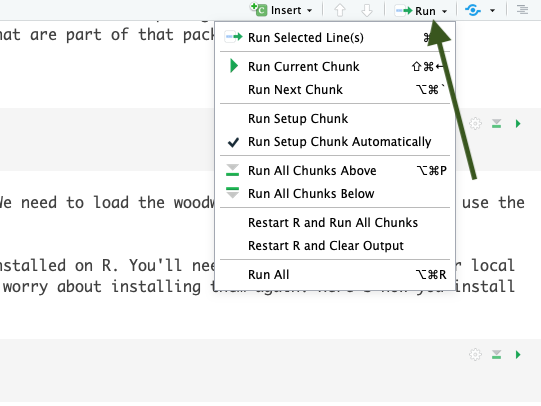

# Getting Started with R

## Why is R so popular?

R is an open-source programming language used for data science,
statistics, and data visualization. R is currently ranked as the [7th
most popular language in the world](http://pypl.github.io/PYPL.html).
Since R is open-source, anyone can contribute to or use R packages that
contain pre-built functions/operations. This greatly accelerates our
ability to share and collaborate.

The purpose of this workshop is to teach working professionals how to
use R for tasks they’d normally use Excel for. Excel is a powerful tool
and is great for a variety of uses, but when it comes to crunching data,
R will greatly improve the speed at which these tasks can be done.
Furthermore, with R, mundane & tedious tasks can be automated. When you
write a script in R for a recurring task such as calculating a monthly
budget, all one needs to do each month is provide the routine with a new
dataset to crunch the numbers. Below are examples of why we use
R.

| Attribute      | Reason                                                                                                                                                                                                                                                                                                                                                                                                                                                                                     |
| -------------- | ------------------------------------------------------------------------------------------------------------------------------------------------------------------------------------------------------------------------------------------------------------------------------------------------------------------------------------------------------------------------------------------------------------------------------------------------------------------------------------------ |
| Speed          | R is FAST. It can number crunch magnitudes faster than Microsoft Excel, for example.                                                                                                                                                                                                                                                                                                                                                                                                       |
| Capacity       | R can handle millions of data records. Large datasets that crash in Microsoft Excel won’t crash in R.                                                                                                                                                                                                                                                                                                                                                                                      |
| Risk Reduction | After writing a single R Script, the process of your data science routine is auditable and reproducible within milliseconds. We can write 1 script and make alterations as we see fit. We don’t have to replicate a process of pointing and clicking in Microsoft Excel or ArcGIS. For example, if you are working with a dataset that multiple people are using, you can load this dataset in R and perform the tasks that you need *without* making any changes to the original dataset. |
| Visualizations | R is capable to create high quality visualizations and also has the capacity to create interactive visualizations that can easiliy be shared. Plots or images can easily be exported to PNG, JPEG, or even web-based interactive dashboards that can be hosted on a webpage                                                                                                                                                                                                                |
| Collaboration  | R script sharing is safe and easy. As mentioned above, a team using the same data input file but performing different tasks on it can do so without editing the data input file for everyone else. Data output can also be shared without the concern of a colleague editing the file output. RStudio connect or Github are also popular free track all changes that take place between R script files.                                                                                    |
| Price          | R is completely free\! Yes…every bit of it\!                                                                                                                                                                                                                                                                                                                                                                                                                                               |

## Installing R

1.  Navigate to the R website: <https://cloud.r-project.org/>

2.  Click Download for your Operating System (Windows, Mac OSx, or Linux
    - if you don’t have a MacBook, then you’re using Windows most
    likely)


3.  Click the most recent R version to download. Install the downloaded
    application as you would with any other application on your
    computer.


## Installing Rstudio

While R is the language, RStudio is the application we use to run R.
Technically speaking, RStudio is an integrated development environment
for R. RStudio makes coding in R easier by highlighting syntax,
autocompleting symbols and names, and visualizing our R environment.
These aspects are explained in further detail in the \[R Coding
Fundamentals\] section. For now, let’s download RStudio.

1.  Navigate to the RStudio Website: <http://www.rstudio.com/download>

2.  Click Download under RStudio Desktop
Free


3.  This website detects your operating system, allowing you to just
    click download again. *Note that if it doesn’t automatically detect
    just select the download next to your operating system below this*

*Note that you may be asked to install command line developer tools if
you’re using a Mac - select
Yes.*


4.  Install the downloaded application as you normally would on your
    computer.

## Video Examples

If you want to watch a step-by-step tutorial on how to install R for Mac
or Windows, you can watch these videos courtest of Dr. Roger Peng

  - [Installing R on Windows](http://youtu.be/Ohnk9hcxf9M)

  - [Installing R on the Mac](https://youtu.be/uxuuWXU-7UQ)

  - [Installing RStudio](https://youtu.be/bM7Sfz-LADM)

## Getting familiar with RStudio

By now you’ve downloaded R and RStudio and you’re probably wondering,
why do I need to download both? R is that programming language that is
running on your computer. RStudio is what we call an Indegrated
Development Environment (IDE) - this is a technical term for a pretty
application that’s all dressed up on the surface but underneath is
really crunching some numbers (using R) at serious speeds. RStudio is
the application we’ll be using. Let’s open RStudio and get familiar with
it.

## Open RStudio

Navigate to your applications folder on your computer. Launch RStudio.
When you open it for the first time, you should see
this.


This is RStudio. When you open it for the first time, we’ll need to open
a new RScript to begin coding.

**Open new R Script**

To open a new R Script, we select the blankpage with green plus icon and
select R Script from the
menu.


This opens up the new R script and we can begin coding in R. Now that we
have the R Script open, you’ll notice 4 quadrants. Let’s run through
what those quadrants
are.

## R Studio Layout


Now let’s describe what’s going on here in a little more detail.

**R Script** - This is your canvas. This is where we write and edit our
code. A lot of trial and error goes on
here.


**R Console** - This is where you run your code. When we talk about
running code, we mean we’re telling R to execute the code we’ve written
in the R Script. R Console is the place inside RStudio where we are
using the R programming
language.


**Variable Environment** - This area keeps track of your variables, data
tables, filenames, etc. Anything that you run in R that has a name will
be stored here. Imagine the Variable Environment to be your closet -
every time you make/buy a new sweater, the sweater goes in the closet.
We can select data tables to view from this list
here.


**Files/Plots/Help** - In this quadrant, we can toggle through files on
our computer (we can view where your files are stored), view
plots/visualizations that we’re creating in R (whenever you create a
plot in R it is output here first), search for help and descriptions of
R functions (there’s descriptions on every function you’ll use in R -
they can all be loaded here in the help tab), and
more.


## Writing a script in R

An R script (also referred to as “code”) is the file we create that uses
the R programming language to accomplish a task. R scripts are saved R
routines that we can load up at any time to perform an action with R.
Every R script is written in the R Script area but **executed** below in
the console area.

### Input & Evaluation

In the R Script area, we write code. Whenever we want to assign a
variable, we do so using the assignment operator. The `<-` symbol is the
assignment operator. We can also use `=` which is a bit more intuitive.
It is alright to interchange these when assigning variables.

``` r
val <- 1
number = 5
my_text = "hello"
my_math <- 9*2 + 5 - 10
```

We write the above code in the R script area. When we are finished
writing, we need to test the code to see if it works. When we test the
code, we’re running the code (also referred to as executing the code). R
code is executed in the console area. In order to run our R code, we
have a few options to do so…

### Running Code

The following are ways we can run our R code.

1)  Highlight the code we wish to run and **click ctrl + enter**
    (Windows) or **cmd + enter** (Mac OSX)
2)  We can “send” our code in the R Script to the R Console using the
    Run Button (located in the top right corner of the R Script area).
    Notice there are various options for what lines to run (selected
    lines, next chunk, current chunk, etc.)
3)  We can copy the lines we wish to run from the R Script area and
    paste them into the R Console.

Each of these methods are useful for running R code, although perhaps
the easiest method is
\#1.



Let’s run the code we wrote above…

``` r
val <- 1
number = 7.779
my_text = "hello"
my_math <- 9 - 2 + 5 - 10
```

After we run these lines of code successfully, these values are now
saved as variables in the R Global Environment area (top right
quadrant). After running, we should see a blinking cursor next to a `>`
symbol in the console. This means we successfully ran this code and the
R console is ready for more. What if we don’t see this?

### Errors

When we code in any programming language, we are practicing trial and
error. The reality is that most of the code we write will have errors in
it and that’s ok\! Even experienced programmers have plenty of errors,
or bugs, in their code. One can measure their programming ability
through how quickly one can diagnose a bug and fix it.

Let’s practice diagnosing and fixing some errors.

``` r
x -< 55
```

When we run the line above, the console returns with a message that
says: **Error: unexpected ‘\<’ in “x -\<”**. What did we do wrong? When
we assign a variable, the assignment operator must be either `=` or
`<-`. Notice that we coded our assignment operator incorrectly like so;
`-<`. We simply need to edit this like so…

``` r
x <- 55
```

Often our errors come down to something as simple as this. Let’s look at
another example…

``` r
val <- 1
number = 7.779
my_text = hello""
my_math <- 9 - 2 + 5 - 10
```

`Error: unexpected string constant in "my_text = hello"""`. Any
character strings (aka text) that we write in R must be **enclosed** in
quotations. Our text message, `hello`, is not **enclosed within** these
quotation marks. Simply enclose `hello` between two quotation marks and
re-run the line. As a quick aside, notice that R *still* successfully
ran the other lines of code - this is because R is an iterative
language.

``` r
val <- 1
number = 7.779
my_text = "hello"
my_math <- 9 - 2 + 5 - 10
```

### Objects & Variables

As mentioned above, when we execute the code above the objects/variables
are stored locally in R and are displayed in the global environment in
the top right quadrant. These objects/variables can now be called at any
point. For example, if we head down to the console and type;

``` r
print(val)
```

R returns `1`, as this is the value we declared for the `val`
variable/object above. We just introduced something new - the `print()`
function. We’ll get into functions later, but the print function is
pretty intuitive - it just prints out values that are stored in R. What
happens if we print `my_math` ?

``` r
print(my_math)
```

R solved the equation we wrote above for us. Now, the `my_math`
variable/object has a stored value of `2`. From this point forward, we
will use the term variable/object interchangeably as they mean the same
thing.

### Variable Names

There are rules associated with naming a variable.

1)  Names are Case Sensitive.
2)  No spaces allowed within the name (i.e. **NO** naming like so `a 1
    = 11`)
3)  Variable names **cannot begin** with a number (i.e. **NO** naming
    like so `1a = 11`)

<!-- end list -->

``` r
# The following are all acceptable variable names
a = 1
A = 55

# We can use underscores _ and periods . within our names as long as there are no spaces
a1 <- 11
a_1 <- 11
a.1 <- 11
```

### Commenting & Note Taking

Commenting is the R term for note taking within our code. We can
describe what is occurring within our code at any line using the comment
symbol `#`. R will ignore anything on a line of code after the comment
symbol `#`. Run the following…

``` r
# set val variable equal to 1
val <- 1 # see how R doesn't run anything on the line beyond the # symbol
num # = 180
```

`Error: object 'num' not found`. We placed the `#` symbol before we
declared the `num` variable. Since R doesn’t have a value stored for
`num` and since we ignored our definition, R will return an error.

``` r
# set val variable equal to 1
val <- 1 # see how R doesn't run anything on the line beyond the # symbol
num = 180 # much better
```

Commenting is always a good idea for future users of the code (including
yourself\!). It is not necessary to comment/take notes on each line, but
it is useful for broader chunks of code as we’ll see when we write
longer scripts.

``` r
# Print out num
print(num)
```

    ## [1] 180

The output above beginning with the `## [1]` is **output from the
tutorials R console**. Technically, it is the *first line* (hence the
\[1\]) of R console output. This is RStudio’s way of discerning between
written code and console output. You will see this more frequently as we
go further in this tutorial and your output should look identical.

### Saving this R script

When we are finished using R for a day, we can save multiple things.
First and foremost, it is **always** a good idea to save your R script.
When we save an R script, we can re-load it and re-run it at any point
in the future. When we write more advanced code, we might need to run an
R script once a month when a new batch of data comes in. We can reload
the R script, plug in the new dataset, and click run - it’s as simple as
that\!

To save an R script…

1)  Click `File > Save`
2)  Choose a folder on your computer to save to.
3)  Create a unique file name with the extension `.R` (such as
    `my_first_script.R`)
4)  Click `Save`

Note that it is **always a good idea** to use underscores (`_`) or
dashes (`-`) instead of spaces in a file name. This is because computing
systems have trouble with spaces from time to time.

When you’re ready to close RStudio…

1)  Make sure all scripts you’ve edited are saved.
2)  Click `x` in the upper corner of your RStudio
3)  You will be prompted with the question of **Save workspace image to
    ~/.RData ?**. What this means is, do you want to save your global
    environment with all the variables currently in there? This can save
    time in the future if you don’t wish to re-run code. Most of the
    time, it’s not a big deal to re-run code and start with a fresh
    RStudio workspace. Typically we select **No** and then are able to
    close RStudio.

**This concludes Day 1 of our Introduction to R Course. Please complete
the Checkpoint Assignments**
