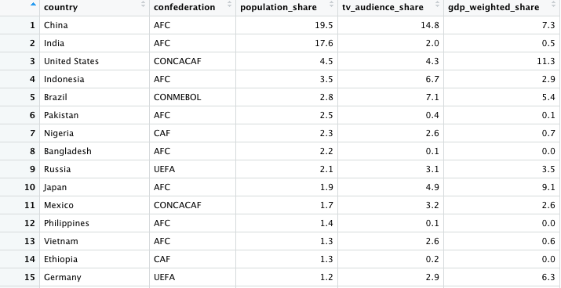

# DataFrames, Indexing, and For Loops
<br>
<br>
```{r, echo=FALSE, out.width="70%", fig.align="center"}
  
```
<br>
<br>

## Data Frames

Data frames are used to store tabular data in R. They are an important
type of object in R and are used in a variety of applications. We'll be working with many dataframes throughout these tutorials. 

Data frames are represented as a special type of list where every
element of the list must  have the same length. Each element of the
list can be thought of as a column and the length of each element of
the list is the number of rows.

Data frames are similar to matrices but one key distinction is that data frames can store different classes of objects in
each column. As a reminder, each element of a matrix must be of the same class (e.g. all integers or all numeric).

In addition to column names, indicating the names of the variables or
predictors, data frames have a special attribute called `row.names`
which indicate information about each row of the data frame.

Data frames are usually created by reading in a dataset using the
`read.table()` or `read.csv()`. However, data frames can also be
created explicitly with the `data.frame()` function or they can be
coerced from other types of objects like lists.

Let's continue to use our fruits example but this time create a dataframe using the `data.frame()` function from the `base` package. 

```{r}
apples = c(2, 1, 3, 0, 5, 7, 3) # apples consumed each day of the week
oranges = c(4, 1, 5, 0, 2, 3, 2) # oranges consumed each day of the week

fruits_df <- data.frame(Apples =  apples, Oranges = oranges)
fruits_df
```

Our Column names are reflected by our specification within the `data.frame()` function. Let's adjust the rownames like we did before.

```{r}
weekday_vector = c("Mon", "Tue", "Wed", "Thu", "Fri", "Sat", "Sun")
rownames(fruits_df) = weekday_vector
fruits_df
```

At this point, `fruits_df` looks identical to our fruits matrix from the previous section. What's the class?

```{r}
class(fruits_df)

```

Remember, the advantage of using a data.frame in R is that it can contain elements of different classes. For example, we could add an additional column to our `fruits_df` with a logical description of whether soccer practice took place.

```{r}
apples = c(2, 1, 3, 0, 5, 7, 3) # apples consumed each day of the week
oranges = c(4, 1, 5, 0, 2, 3, 2) # oranges consumed each day of the week
soccer_practice = c(FALSE, TRUE, FALSE, TRUE, FALSE, FALSE, FALSE
                    )
fruits_df <- data.frame(Apples =  apples, Oranges = oranges, Soccer_Practice = soccer_practice)

weekday_vector = c("Mon", "Tue", "Wed", "Thu", "Fri", "Sat", "Sun")
rownames(fruits_df) = weekday_vector
fruits_df

```

Data Frames are a powerful class in R. We can actually click on our `fruits_df` data.frame in the global environment and visualize it. This is only recommended if you are dealing with a smaller data frame as larger data frames can freeze your computer if you visualize the table. 


## Indexing Data Frames

Indexing is a skill necessary for shrinking a dataset or extracting specific information. Through indexing, we can isolate a column, a row, or even replace data. For example, let's say we only want to handle the `Apples` column within the `fruits_df` dataframe. This can be done via indexing like so...

```{r}
fruits_df["Apples"]
```

Using this notation of calling the data.frame, using square brackets `[]` with the appropriate column name inside (`"Apples"`), we were able to isolate only the `Apples` column within this dataframe.Let's say, for example, that we only want to use the data within that column and don't care for the data.frame of just that column. 

```{r}
fruits_df[,"Apples"]
```

What's the difference? Notice the **comma** preceding the `"Apples"` name. Data is stored as `data[row, column]` in R. Therefore, when we use code like `fruits_df[,"Apples"]`, we're telling R that we want to grab *all rows of data* and the `"Apples"` column.  The same can be performed using numeric operation.

```{r}
fruits_df[,1]
```

We named our columns within our `fruits_df` Data Frame and that's why we can use the column names to subset data. However, these rows and columns *also* have numbers associated with them. When we code `fruits_df[,1]`, we're telling R that we want *all* rows and the *first* column. When we want *all* rows or columns, simply leave the space blank before/after a comma. We can subset even further by selecting the specific row that we want. 

```{r}
fruits_df[5,1]
```

Here we grab the `fruits_df` data point from the 5th row and 1st column within the `fruits_df`. *This is indexing/subsetting!* We're taking a piece of our dataframe that we select using the square brackets `[]` . An important note is that this is *the same way matrixes can be indexed/subset*. One advantage that data frames has over matrices aside from the mixed class of elements it can hold is the use of the `$` operator. 

```{r}
fruits_df$Apples
```

When the `$` operator is used immediately following a data frame call, we can access the vector of data specified within that column of our dataframe. When we return a vector of data like we can with `fruits_df$Apples`, we've subsetted that specific column. Therefore, we no longer have the option to specify using `data[row,column]` since we only have 1 column. Instead, we can subset to only a specific row *within* that column.

```{r}
fruits_df$Apples[5]
```

This returns the element within the 5th row of the `Apples` column of the `fruits_df` dataframe. Indexing will be very useful for dataframes and other classes of data moving forward. 

## For Loops

For loops & conditional statements are a key skill in programming. They allow you to automate a process and decrease the amount of manual work performed. They remove tedious procedures. For loops often contain the use of arithmetic **and** conditonal operators. 

<br>
<br>

| Operator Name | Example | Definition |
|--------|------------------|--------------------------|
| arithmetic operators | `+,-,*,/,^` | Math operators used for addition, subtraction, multiplication, division, exponent, respectively. |
| comparison operators | `==, <, >, <=, >=, !=`| Is equal to, less than, greater than, less than or equal to, greater than or equal to, is NOT equal to, respectively | 
| and/or operators  | `&, |` | AND, OR | 

<br>
<br>

We've already discussed and even used some of these operators but they commonly occur within a for loop. The general structure of a for loop looks like...


`for (condition){`<br />
`perform action`<br />
`}`


Let's loop through a sequence of numbers. 
```{r}
# Generate sequence of numbers from 1 to 10 using the seq() function
numbersList = seq(from=1,to=10,by=1)
# print the value of i
for (i in numbersList){
  print(i)
}
```

Here, our *condition* is to loop through each *`i`* value within numbersList. The value is *`i`* changes with each *iteration of the loop*. The action we perform is *printing `i`*. `i` is arbitrary and can be called whatever temporary variable name we want. For example, let's use `asdf` instead of `i`. 

```{r}
# Generate sequence of numbers from 1 to 10 using the seq() function
numbersList = seq(from=1,to=10,by=1)
# print the value of i
for (asdf in numbersList){
  print(asdf)
}
```

The result is the same. The condition is always initiated by a **for** call and then placed **inside parentheses**. The action we perform is always follows the condition and is placed **inside curly brackets**. Always remember, `for(condition){perform action}`

Now let's build of the above example and use some of our conditional. 

```{r}
# Generate sequence of numbers from 1 to 10 using the seq() function
numbersList = seq(from=1,to=10,by=1)
# print i if the number is greater than 4
for (i in numbersList){
  if (i > 4){
    print(i)
  }
}
```

This is referred to as a **nested loop** because we have an **if statement** within a **for loop**. The general structure is `for(condition){if(condition){perform action}}`. In this example, we only print `i` if `i` is greater than 4. What happens if we change the `numbersList`?
```{r}
# Generate sequence of numbers from 70 to 80 using the seq() function
numbersList = seq(from=70,to=80,by=1)
# print i 
for (i in numbersList){
  print(i)
}
```

Now, let's say there's a scenario where we care more about the total number of values within `numbersList` as opposed to the actual `numbersList` value. We can use `1:length(numbersList)` to accomplish this.

```{r}
# Generate sequence of numbers from 70 to 80 using the seq() function
numbersList = seq(from=70,to=80,by=1)
length(numbersList)
# print i 
for (i in 1:length(numbersList)){
  print(i)
}
```

Notice that the length of `numbersList` is 11 and that `i` is ranging from values of 1 to 11. The colon operator `:` acts as a sequence maker that automatically spans by 1 between two values. 

In the next scenario, let's loop from 1 to the length of `numbersList` and then if our loop variable `i` is equal to 7, let's multiple the 7th value of the `numbersList` by 8 and store it as `temNumber`. 

```{r}
# Generate sequence of numbers from 1 to 10 using the seq() function
numbersList = seq(from=70,to=80,by=1)
print(numbersList[7])
# multiply numbersList[i] by 8 if i is equal to 7 
for (i in 1:length(numbersList)){
  if (i == 7){
    temNumber = numbersList[i] * 8
  }
}

print(i)
print(temNumber)
```
The first condition specifies that to loop through each `i` **between** 1 *and* the length of `numbersList`. With our condition specified like this, are *still looping from 1 to 10*. The second condition specifies that **if** `i` is exactly equal to 7, multiply with 7th value in `numbersList` (aka `numbersList[7]`) by 8 and store it as `temNumber`. Afterwards, we print out `i` and `temNumber`. We notice that `i` is equal to 11, the length of our `numbersList`. Meanwhile, `temNumber` is equal to 608, since `i` was exactly equal to 7 and thus 76 (`numbersList[7]`) was multiplied by 8. 

For loops are very customizable as we can see above. Let's explore one more example and this time use our `fruit_df` data frame to answer a question. **How many Apples were consumed on days where there was no soccer practice?**

```{r}
for (d in 1:length(fruits_df$Apples)){
  if (fruits_df$Soccer_Practice[d] == FALSE){
    print(fruits_df$Apples[d])
  }
}
```

This lists all of the apples consumed on days where there was no soccer practice. Now, we could manually add up these values to find the total number of apples consumed. However, we're here to learn how R can crunch that number for us. In order to crunch that number, we'll need to introduce a new function called `append()`. `append()` literally appends values to the end of an existing vector. For example...

```{r}
# create a new vector called numbers_vec
numbers_vec = c(19)
print(numbers_vec)

# use the append function to add 24 to the end of our vector
numbers_vec = append(x = numbers_vec, values = 24)
print(numbers_vec)
```

Notice that we are **overwriting** `numbers_vec`. Now, our `numbers_vec` vector *includes* the original 19 *and* 24. Now that we know how to use this, we can bring this into our for loop and create a new vector that only contains apples consumed on days where there was no soccer practice.

```{r}
# create new_apples blank vector
new_apples = c()
for (d in 1:length(fruits_df$Apples)){
  if (fruits_df$Soccer_Practice[d] == FALSE){
    new_apples = append(x = new_apples, fruits_df$Apples[d])
  }
}

# print the new_apples values
new_apples
# sum the total number of apples consumed when there was no soccer practice
sum(new_apples)
```

There were 20 apples consumed on days where there was no soccer practice. 


