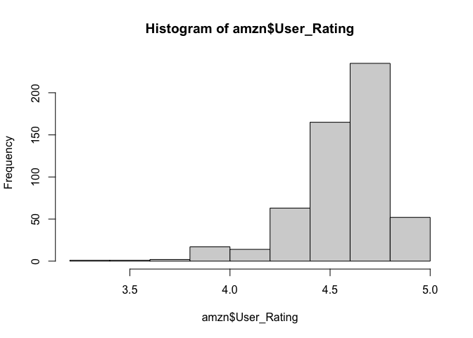
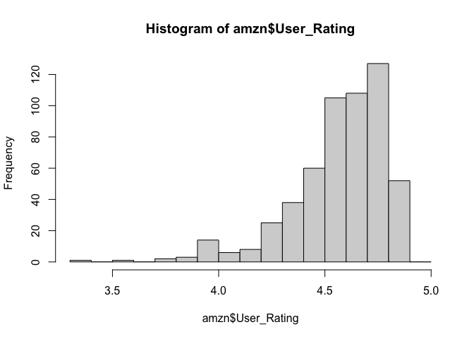
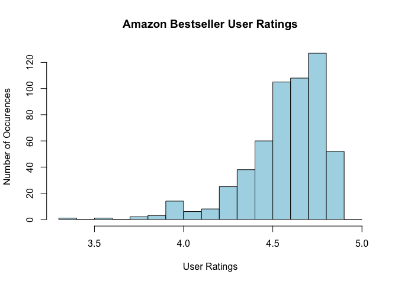
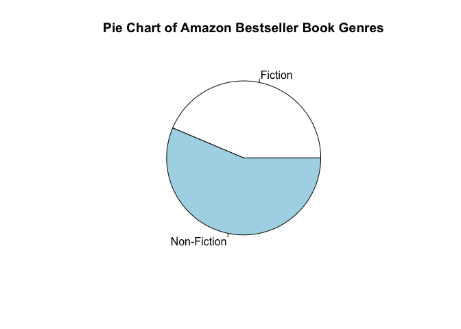
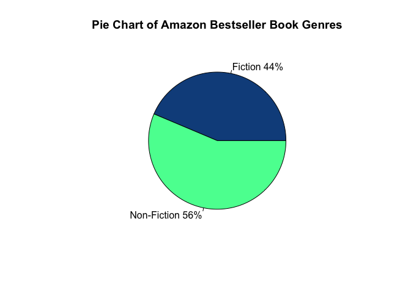
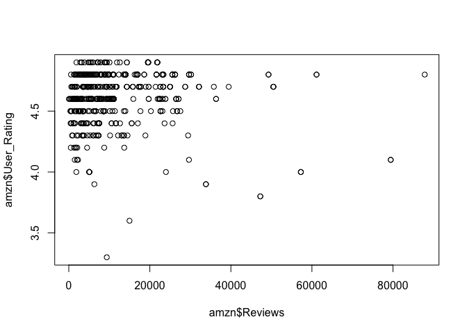
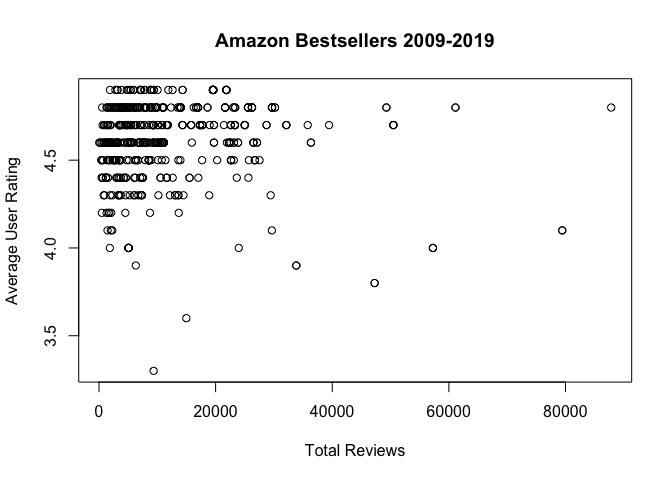
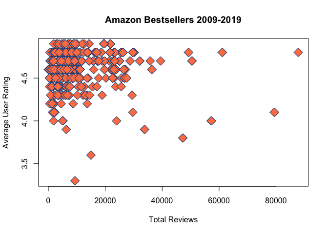

# Dataset Ingest and Plotting

<br> <br>

<br> <br> Reading data into R is a regular practice. R can ingest almost
any type of file including CSV, Excel, Binary, XML, JSON, and many more.
Today, we’re going to read in a Microsoft Excel file into R. This file
contains data on best-selling books from Amazon between 2009 and 2019.
Before we begin, we will need to download the `amazon_bestsellers.xlxs`
file from the course datasets folder.

## Installing a Package

So far, we’ve only been using functions that are part of the `base`
package and are automatically loaded into each session by RStudio. There
are over 10,000 R packages available for download from R’s package
repository. All of these packages are free and contain pre-written
functions for just about any computing purpose. Today, we’re going to
use the `readxl` package. This package helps us read Microsoft Excel
files in R. Let’s load in this package.

``` r
library(readxl)
```

`Error in library(readxl) : there is no package called ‘readxl’`. This
package is not currently installed. We can install the function now
using the `install.packages()` function from the pre-loaded `base`
package.

``` r
install.packages("readxl")
```

You may need to select a **CRAN Mirror** before installing. CRAN stands
for Comprehensive R Archive Network and it is a repository for R
packages that is a replica of the primary R package database. You can
select any of these mirrors, but it is recommended that you choose a
mirror located in the United States if RStudio asks you to choose one.

**Only use the** `install.packages()` **function in the console**. Why?
We only need to install a package once. After the package is installed,
we will need to *load the package into each R session* but we will not
need to install it again.

After `readxl` is installed correctly, you’ll see a message that looks
like this;

`The downloaded binary packages are in
/var/folders/6m/1b7gn_m93g9380p1jxvm2_700000gr/T//Rtmpcuw03I/downloaded_packages`

This is the location on your computer where the package and all it’s
functions are stored. We don’t need to worry about the location as R
handles this information for us. We also don’t need to worry about
packages taking up significant space on our hard drives. R packages are
small in size. Now that `readxl` is installed, we can load it in via the
`library()` function like we did above. This time, however, it should
load in without any errors.

``` r
library(readxl)
```

Wonderful, now we can use functions from the `readxl` package. What
happens if we try and use a function from `readxl` without first loading
the package? R will not understand what you mean and return an error. We
must always load in package with each R session and **before** we use a
function in a script. This is why we load in packages that we need at
the top of every R script - so they’re run first.

## Reading Data

We’re ready to use the `readxl` package. What function can we use from
this package to load in our dataset? Remember the `help()` function
where we can find our more information on functions? We can use
`??readxl` in the R console to find out more information on functions
within this package.

``` r
??readxl
```

The `??` function runs a search on every function/package we have in R
and looks for functions/packages containing `readxl`. Look for examples
that begin with `readxl::`. This notation is used to inform us of
packages and functions, i.e. `package::function`. Technically speaking,
we *don’t have to* load in a package if we use this notation…but it’s a
lot easier to just load in the package than to code every function as
`package::function`. The notation of `package::function` is primarily
used by certain software developers. For our purposes, loading in a
package at the top of the script is perfectly acceptable and
recommended. Remember, our goal is just to tell R where to find a
function so we can use it.

Now that we have searched, we can see a line that reads as:
`readxl::read_excel Read xls and xlsx files`. We will use this function,
`read_excel`, to read our `amazon_bestsellers.xlxs`. What arguments does
the `read_excel`function take? We can use our `help()` function to find
out.

``` r
help(read_excel)
```

A shortcut for the `help` function is a single `?` and is used like so…

``` r
?read_excel
```

There are many arguments we can tinker with here if we needed to, but we
only need to be concerned with the `path` argument that defines the
“Path to the xls/xlsx file”.

## Paths

A path is a series of folder names that directs the computer to the
location of a file. For example, if we download a file called
`amazon_bestsellers.xlsx`, it is likely residing in our downloads
folder. Our job is to find the path to that file. It *might* look like
`/Users/your_name/Downloads/amazon_bestsellers.xlsx` on Mac or
`C:\your_name\Downloads\amazon_bestsellers.xlsx`, but is there a way to
check for it exactly? Let’s introduce the `getwd()`, or get working
directory, function.

``` r
getwd()
```

My current directory (aka path) is `/Users/james`. This is where the
“Home” direcoty is located in the files pane of our bottom right hand
quadrant. Thus, in order for me to navigate to the Downloads folder, I
simply need to type `"Downloads/amazon_bestsellers.xlsx"`. Additionally,
if I wanted to, I could *change* the current path of the working
directory with the `setwd()` function (aka set working directory).

``` r
setwd("Downloads")
```

Now, if I use `getwd()` again…

``` r
getwd()
```

I find that my new working directory is `/Users/james/Downloads`. Thus,
my full path to the `amazon_bestsellers.xlsx` file is
`/Users/james/Downloads/amazon_bestsellers.xls`.

### Path Navigation Trick

The `tab` key on our keyboard is a shortcut key for autocompletion. We
can hit the `tab` key within a set of quotes `""` and a visualization of
the files and folders of the current working directory will appear. From
this point, we can actually click our way to a file and R Studio will
automatically fill out the file path to the file for us. This keyboard
shortcut can also be used to autocomplete functions, variables/objects,
and packages. For example, if I have one really long variable
name…

``` r
onereaaaaaaalllllllyyyyylonnnngggggggvarrriabbblleeeeennnnaaammmeee = "use tab for a shortcut to this"
```

I can start typing the first few letters or so and click the `tab` key
for an autocomplete menu to appear. If the top result is indeed what we
want, we can hit the `tab` key *again* and the full name of the variable
will autocomplete for us. This *can also be used* to list argument names
within a function. The `tab` key is a great tool and can save us time
and headache from mistyping paths or names.

### Reading in the File

Now that we have the path, we can finally use our `read_excel`
function.

``` r
# open our amazon bestsellers file using read_excel from the readxl package
amzn = read_excel(path = "/Users/james/Downloads/amazon_bestsellers.xlsx")
```

``` r
class(amzn)
```

    ## [1] "tbl_df"     "tbl"        "data.frame"

We read in our file succesfully but it was read in as a tibble dataframe
by the `read_excel` function. This is a more advanced form of a
dataframe that goes beyond the scope of this course. Let’s convert it to
just a standard data frame using our `data.frame()`
function.

``` r
# overwrite our amzn tibble dataframe and convert it to a standard dataframe 
amzn = data.frame(amzn)
class(amzn)
```

    ## [1] "data.frame"

Much better. Now let’s print out the first few rows of the `amzn`
dataframe using the `head()` function to get a feel for the
    dataset…

``` r
head(amzn)
```

    ##                                                                 Name
    ## 1                                      10-Day Green Smoothie Cleanse
    ## 2                                                  11/22/63: A Novel
    ## 3                            12 Rules for Life: An Antidote to Chaos
    ## 4                                             1984 (Signet Classics)
    ## 5 5,000 Awesome Facts (About Everything!) (National Geographic Kids)
    ## 6                      A Dance with Dragons (A Song of Ice and Fire)
    ##                     Author User.Rating Reviews Price Year       Genre
    ## 1                 JJ Smith         4.7   17350     8 2016 Non Fiction
    ## 2             Stephen King         4.6    2052    22 2011     Fiction
    ## 3       Jordan B. Peterson         4.7   18979    15 2018 Non Fiction
    ## 4            George Orwell         4.7   21424     6 2017     Fiction
    ## 5 National Geographic Kids         4.8    7665    12 2019 Non Fiction
    ## 6      George R. R. Martin         4.4   12643    11 2011     Fiction

Here is a description of what this file contains.

| Variable Name | Definition                                      |
| ------------- | ----------------------------------------------- |
| Name          | Book Title                                      |
| Author        | Author of the Book                              |
| User Rating   | Amazon book rating as of 10/13/2020             |
| Reviews       | Total number of book reviews                    |
| Price         | Book price as of 10/13/2020                     |
| Year          | Year it was in the top 50 bestsellers on Amazon |
| Genre         | Book Genre                                      |

We can actually sort the data by any of the variables we want using the
`order()` function. Let’s order the dataframe based on the User Rating.

``` r
order(amzn$User Rating, decreasing=TRUE)
```

`Error: unexpected symbol in "order(amzn$User Rating"`. This is an
example of how spaces are bad. R is unable to get around the space
between User and Rating in thr variable name. Thus, we will need to
rename this variable name to get rid of
this.

``` r
# use indexing to configure which column User Rating is. We know it is the 3rd column
amzn[,3]
```

    ##   [1] 4.7 4.6 4.7 4.7 4.8 4.4 4.7 4.7 4.7 4.6 4.6 4.6 4.6 4.5 4.6 4.5 4.6 4.4
    ##  [19] 4.5 4.8 4.6 4.6 3.9 4.6 4.3 4.6 4.7 4.2 4.6 4.6 4.8 4.7 4.8 4.8 4.8 4.7
    ##  [37] 4.7 4.7 4.6 4.5 4.9 4.9 4.8 4.6 4.8 4.5 4.7 4.7 4.7 4.7 4.7 4.7 4.7 4.3
    ##  [55] 4.8 4.8 4.6 4.6 4.8 4.4 4.6 4.3 4.2 4.8 4.8 4.8 4.8 4.6 4.6 4.5 4.5 4.8
    ##  [73] 4.8 4.8 4.6 4.6 4.6 4.5 4.6 4.7 4.8 4.9 4.9 4.9 4.9 4.9 4.9 4.9 4.8 4.6
    ##  [91] 4.5 4.5 4.3 4.5 4.5 4.7 4.7 4.7 4.7 4.7 4.6 4.6 4.7 4.4 4.4 4.5 3.8 3.8
    ## [109] 4.5 4.2 4.7 4.7 4.7 4.7 4.7 4.4 4.7 4.4 4.6 4.6 4.6 4.5 4.6 4.8 4.8 4.8
    ## [127] 4.8 4.8 4.6 4.6 4.6 4.6 3.6 4.8 4.6 4.0 4.0 4.0 4.6 4.5 4.5 4.5 4.5 4.8
    ## [145] 4.8 4.8 4.9 4.9 4.6 4.4 4.8 4.9 4.8 4.9 4.0 4.9 4.9 4.9 4.7 4.8 4.8 4.7
    ## [163] 4.7 4.4 4.4 4.8 4.7 4.7 4.7 4.7 4.7 4.3 4.8 4.8 4.9 4.7 4.8 4.6 4.8 4.8
    ## [181] 4.3 4.4 4.1 4.6 4.4 4.4 4.8 4.9 4.9 4.9 4.9 4.9 4.9 4.6 4.5 4.6 4.5 4.6
    ## [199] 4.7 4.7 4.6 4.6 4.8 4.8 4.5 4.5 4.5 4.9 4.6 4.6 4.6 4.6 4.6 4.5 4.5 4.4
    ## [217] 4.8 4.5 4.1 4.9 4.5 4.5 4.2 4.8 4.8 4.8 4.5 4.7 4.8 4.7 4.7 4.7 4.4 4.6
    ## [235] 4.6 4.6 4.5 4.5 4.5 4.8 4.8 4.6 4.7 4.6 4.9 4.9 4.9 4.9 4.9 4.9 4.9 4.9
    ## [253] 4.9 4.8 4.2 4.6 4.6 4.5 4.3 4.6 4.6 4.6 4.7 4.7 4.8 4.8 4.8 4.8 4.7 4.3
    ## [271] 4.3 4.5 4.5 4.5 4.5 4.5 4.5 4.5 4.5 4.5 4.5 4.8 4.6 4.6 4.7 4.7 4.6 4.6
    ## [289] 4.9 4.9 4.8 4.8 4.6 4.8 4.8 4.7 4.7 4.8 4.1 4.7 4.6 4.6 4.6 4.9 4.0 4.0
    ## [307] 4.0 4.0 4.0 4.0 4.0 4.0 4.0 4.5 4.6 4.5 4.4 4.4 4.3 4.3 4.7 4.7 4.7 4.7
    ## [325] 4.7 4.8 4.8 4.8 4.8 4.8 4.8 4.6 4.6 4.6 4.6 4.7 4.7 4.7 4.7 4.6 4.7 4.7
    ## [343] 4.7 4.8 4.2 4.8 4.7 4.6 4.6 4.8 4.8 4.8 4.8 3.3 4.7 4.3 4.3 4.3 4.8 4.4
    ## [361] 4.8 4.8 4.8 4.1 4.0 4.7 4.7 4.7 4.7 4.6 4.6 4.6 4.6 4.6 4.6 4.7 4.7 4.7
    ## [379] 4.7 4.7 4.7 4.8 4.1 4.1 4.7 4.7 4.7 4.7 4.4 4.4 4.8 4.8 3.9 3.9 4.4 4.4
    ## [397] 4.4 4.5 4.7 4.3 4.6 4.8 4.8 4.8 4.8 4.8 4.8 4.7 4.7 4.7 4.8 4.8 4.7 4.7
    ## [415] 4.7 4.3 4.3 4.7 4.8 4.8 4.9 4.4 4.4 4.5 4.5 4.5 4.5 4.4 4.8 4.2 4.8 4.9
    ## [433] 4.8 4.7 4.5 4.8 4.6 4.8 4.8 4.4 4.4 4.4 4.4 4.4 4.3 4.3 4.8 4.8 4.8 4.5
    ## [451] 4.4 4.8 4.8 4.6 4.3 4.3 4.6 4.6 4.8 4.6 4.6 4.6 4.5 4.8 4.6 4.6 4.6 4.7
    ## [469] 4.7 4.7 4.4 4.4 4.7 4.7 4.8 4.7 4.9 4.9 4.9 4.9 4.9 4.9 4.9 4.6 4.6 4.6
    ## [487] 4.9 4.9 4.9 4.9 4.8 4.8 4.7 4.7 4.6 4.6 4.5 4.5 4.3 4.3 4.6 4.6 4.6 4.6
    ## [505] 4.3 4.8 4.8 4.8 4.8 4.8 4.6 4.8 4.5 4.7 4.5 4.8 4.8 4.8 4.8 4.8 4.3 4.9
    ## [523] 4.8 4.7 4.8 4.5 4.6 4.7 4.7 4.8 4.4 4.4 4.4 4.8 4.8 4.8 4.6 4.4 4.5 4.2
    ## [541] 4.8 4.8 4.8 4.8 4.8 4.9 4.7 4.7 4.7 4.7

``` r
# create new column named User_Rating that doesn't contain spaces and give it the values of the original User Rating variable name 
amzn['User_Rating'] = amzn[,3]

# print the first few lines of amzn
head(amzn)
```

    ##                                                                 Name
    ## 1                                      10-Day Green Smoothie Cleanse
    ## 2                                                  11/22/63: A Novel
    ## 3                            12 Rules for Life: An Antidote to Chaos
    ## 4                                             1984 (Signet Classics)
    ## 5 5,000 Awesome Facts (About Everything!) (National Geographic Kids)
    ## 6                      A Dance with Dragons (A Song of Ice and Fire)
    ##                     Author User.Rating Reviews Price Year       Genre
    ## 1                 JJ Smith         4.7   17350     8 2016 Non Fiction
    ## 2             Stephen King         4.6    2052    22 2011     Fiction
    ## 3       Jordan B. Peterson         4.7   18979    15 2018 Non Fiction
    ## 4            George Orwell         4.7   21424     6 2017     Fiction
    ## 5 National Geographic Kids         4.8    7665    12 2019 Non Fiction
    ## 6      George R. R. Martin         4.4   12643    11 2011     Fiction
    ##   User_Rating
    ## 1         4.7
    ## 2         4.6
    ## 3         4.7
    ## 4         4.7
    ## 5         4.8
    ## 6         4.4

Now we have a properly named `User_Rating` variable and we can delete
the faulty variable name from earlier.

``` r
# remove the 3rd column which is currently User Rating with a space
amzn[,3] = NULL
```

Using the code `amzn[,3] = NULL`, we effectively removed the 3rd column
of the `amzn` dataframe. We need to be very careful **not to run this
line again** as it will remove the 3rd column each time you run it. So,
if we were to accidentally run this again, we would remove the `Reviews`
variable within this dataframe which is not what we want to do.

``` r
# print the variable names of the amzn dataframe
names(amzn)
```

    ## [1] "Name"        "Author"      "Reviews"     "Price"       "Year"       
    ## [6] "Genre"       "User_Rating"

Now that our names have been fixed, we can look at an order of the
highest rated books using the `order()` function on the `User_Rating`
variable.

``` r
# print the order of the user ratings
order(amzn$User_Rating, decreasing=TRUE)
```

    ##   [1]  41  42  82  83  84  85  86  87  88 147 148 152 154 156 157 158 175 188
    ##  [19] 189 190 191 192 193 208 220 245 246 247 248 249 250 251 252 253 289 290
    ##  [37] 304 421 432 477 478 479 480 481 482 483 487 488 489 490 522 546   5  20
    ##  [55]  31  33  34  35  43  45  55  56  59  64  65  66  67  72  73  74  81  89
    ##  [73] 124 125 126 127 128 134 144 145 146 151 153 160 161 166 173 174 177 179
    ##  [91] 180 187 203 204 217 224 225 226 229 240 241 254 265 266 267 268 282 291
    ## [109] 292 294 295 298 326 327 328 329 330 331 344 346 350 351 352 353 359 361
    ## [127] 362 363 382 391 392 402 403 404 405 406 407 411 412 419 420 429 431 433
    ## [145] 436 438 439 447 448 449 452 453 459 464 475 491 492 506 507 508 509 510
    ## [163] 512 516 517 518 519 520 523 525 530 534 535 536 541 542 543 544 545   1
    ## [181]   3   4   7   8   9  27  32  36  37  38  47  48  49  50  51  52  53  80
    ## [199]  96  97  98  99 100 103 111 112 113 114 115 117 159 162 163 167 168 169
    ## [217] 170 171 176 199 200 228 230 231 232 243 263 264 269 285 286 296 297 300
    ## [235] 321 322 323 324 325 336 337 338 339 341 342 343 347 355 366 367 368 369
    ## [253] 376 377 378 379 380 381 385 386 387 388 399 408 409 410 413 414 415 418
    ## [271] 434 468 469 470 473 474 476 493 494 514 524 528 529 547 548 549 550   2
    ## [289]  10  11  12  13  15  17  21  22  24  26  29  30  39  44  57  58  61  68
    ## [307]  69  75  76  77  79  90 101 102 119 120 121 123 129 130 131 132 135 139
    ## [325] 149 178 184 194 196 198 201 202 209 210 211 212 213 234 235 236 242 244
    ## [343] 256 257 260 261 262 283 284 287 288 293 301 302 303 315 332 333 334 335
    ## [361] 340 348 349 370 371 372 373 374 375 401 437 454 457 458 460 461 462 465
    ## [379] 466 467 484 485 486 495 496 501 502 503 504 511 527 537  14  16  19  40
    ## [397]  46  70  71  78  91  92  94  95 106 109 122 140 141 142 143 195 197 205
    ## [415] 206 207 214 215 218 221 222 227 237 238 239 258 272 273 274 275 276 277
    ## [433] 278 279 280 281 314 316 398 424 425 426 427 435 450 463 497 498 513 515
    ## [451] 526 539   6  18  60 104 105 116 118 150 164 165 182 185 186 216 233 317
    ## [469] 318 360 389 390 395 396 397 422 423 428 440 441 442 443 444 451 471 472
    ## [487] 531 532 533 538  25  54  62  93 172 181 259 270 271 319 320 356 357 358
    ## [505] 400 416 417 445 446 455 456 499 500 505 521  28  63 110 223 255 345 430
    ## [523] 540 183 219 299 364 383 384 136 137 138 155 305 306 307 308 309 310 311
    ## [541] 312 313 365  23 393 394 107 108 133 354

This returns the the relative order of each book’s rating (remember,
each book has it’s own **row**). As we can see, the 1st book has the
41st ranked rating. How can we actually re-order our dataframe so that
we are sorted from the highest rated to the lowest rated?

``` r
# reorder our rows based on the user rating column
amzn = amzn[order(amzn$User_Rating, decreasing=TRUE),]
```

In the line above, re-order each row for all columns **based** on the
`User_Rating` column. We use our handy index brackets `[]` that take a
`row` and `column` argument to sort each row based on the relative index
order of the `User_Rating`. The `column` space (aka after the comma that
is *outside* of the `order()` function) is left blank so we include
*all* columns with this sorting measure. In short, this keeps each row
set to the exact same but orders them based on their User Ratings.

``` r
# print the top few rows
head(amzn)
```

    ##                                                                                   Name
    ## 41                                            Brown Bear, Brown Bear, What Do You See?
    ## 42                                            Brown Bear, Brown Bear, What Do You See?
    ## 82            Dog Man and Cat Kid: From the Creator of Captain Underpants (Dog Man #4)
    ## 83 Dog Man: A Tale of Two Kitties: From the Creator of Captain Underpants (Dog Man #3)
    ## 84     Dog Man: Brawl of the Wild: From the Creator of Captain Underpants (Dog Man #6)
    ## 85     Dog Man: Brawl of the Wild: From the Creator of Captain Underpants (Dog Man #6)
    ##             Author Reviews Price Year   Genre User_Rating
    ## 41 Bill Martin Jr.   14344     5 2017 Fiction         4.9
    ## 42 Bill Martin Jr.   14344     5 2019 Fiction         4.9
    ## 82      Dav Pilkey    5062     6 2018 Fiction         4.9
    ## 83      Dav Pilkey    4786     8 2017 Fiction         4.9
    ## 84      Dav Pilkey    7235     4 2018 Fiction         4.9
    ## 85      Dav Pilkey    7235     4 2019 Fiction         4.9

``` r
# print the last few rows
tail(amzn)
```

    ##                                                                                         Name
    ## 393                                      The Goldfinch: A Novel (Pulitzer Prize for Fiction)
    ## 394                                      The Goldfinch: A Novel (Pulitzer Prize for Fiction)
    ## 107 Fifty Shades of Grey: Book One of the Fifty Shades Trilogy (Fifty Shades of Grey Series)
    ## 108 Fifty Shades of Grey: Book One of the Fifty Shades Trilogy (Fifty Shades of Grey Series)
    ## 133                                                               Go Set a Watchman: A Novel
    ## 354                                                                       The Casual Vacancy
    ##           Author Reviews Price Year   Genre User_Rating
    ## 393  Donna Tartt   33844    20 2013 Fiction         3.9
    ## 394  Donna Tartt   33844    20 2014 Fiction         3.9
    ## 107    E L James   47265    14 2012 Fiction         3.8
    ## 108    E L James   47265    14 2013 Fiction         3.8
    ## 133   Harper Lee   14982    19 2015 Fiction         3.6
    ## 354 J.K. Rowling    9372    12 2012 Fiction         3.3

Our new column name

## Plotting the Data

We use plotting as a data visualization method. Plotting the data is a
way to tell a story about the data. R has some fantastic plotting
packages such as `ggplot2`, `Lattice`, and `leaflet` that are covered in
other courses. Today, let’s introduce the R `base` plotting functions
that offer basic, yet very customizable, visualizations.

### Base Plotting

Base plotting in R comes with an ability to create scatter plots, bar
plots, pie charts, histograms, line charts, etc. These are very
customizable and offer a solid foundation when transitioning to more
advanced plotting packages. While many programmers prefer plotting
packages mentioned above, we can still use the `base` plotting functions
from R to create aesthetically pleasing plots. When we are plotting,
arguments become very important and these plotting functions can take
many arguments.

### Histograms

Histograms are visual representations of a spread of data. We can use
these to quantify where the most frequent values are binned. Let’s
create a histogram of the User Ratings.

``` r
# histogram of the user rating vector from the amzn dataframe
hist(x = amzn$User_Rating)
```

<!-- -->

The breaks, or bin width, of this histogram is pretty wide. Let’s create
finer break areas by listing each rating in a sequence
function.

``` r
# histogram of the user rating from the amzn dataframe with breaks from 3.3 to 5 spaced by 0.1
hist(x = amzn$User_Rating, breaks = seq(from = 3.3, to= 5.0, by=0.1))
```

<!-- -->

A user rating of 4.8 is the most popular rating for this best seller
colleciton of books. From here, we can customize the title, color, x
label, y label, etc. Unsure of which arguments you can set? Don’t forget
about the help function `?hist`
.

``` r
# histogram of the user rating from the amzn dataframe with breaks from 3.3 to 5 spaced by 0.1
hist(x = amzn$User_Rating, breaks = seq(from = 3.3, to= 5.0, by=0.1),
     main = "Amazon Bestseller User Ratings", col = "lightblue", xlab = "User Ratings",
     ylab = "Number of Occurences")
```

<!-- -->

From the help function we found out the that these arguments dictate the
following parameters:

| Argument Name | Definition             |
| ------------- | ---------------------- |
| `main`        | Plot Title             |
| `col`         | Color of the histogram |
| `xlab`        | X label name           |
| `ylab`        | Y label name           |

Each plotting function *generally* follows the same argument naming
scheme. However, they can vary, and this is why it’s important to use
the `help()` function for a plotting function. Additionally, a useful
link to bookmark is the [R Color Naming
Guide](http://www.stat.columbia.edu/~tzheng/files/Rcolor.pdf). This
contains the names of preloaded color names in R. This is where I found
`lightblue`.

### Pie Chart

Pie charts are useful plots when comparing the number of occurrences for
categorical information. For example, one might use a pie chart for
wins/losses of a sports team. One of the variables from the Amazon
BestSellers dataset is Book Genre. Let’s create a pie chart that shows a
pie chart of the genres. First, we’ll need to know which genres are part
of the Amazon Book Genre dataset.

``` r
# use the unique function to print the genres 
unique(amzn$Genre)
```

    ## [1] "Fiction"     "Non Fiction"

So there are only two broad genres within this dataset. Nonetheless,
let’s create a pie chart of these. Let’s count the total number of
occurrences for each genre.

``` r
# count the total number of occurrences for each genre.
fic = sum(amzn$Genre == 'Fiction')
nonfic = sum(amzn$Genre == 'Non Fiction')
```

Now, we can use these total numbers to create our
piechart.

``` r
# create a vector called slices that contain total number of fiction and nonfiction books
slices <- c(fic, nonfic)
# create a vector called lbls that contain labels for the respective total number of fiction and nonfiction books
lbls <- c("Fiction", "Non-Fiction")
# plot using the pie function
pie(x = slices, labels = lbls, main="Pie Chart of Amazon Bestseller Book Genres")
```

<!-- -->

This is a good start. Let’s customize this more by adding colors and
percentage values.

``` r
# create a pct vector that calculates the percentages of each value 
pct <- round(slices/sum(slices)*100)
lbls <- paste(lbls, pct) # add percents to labels
lbls
```

    ## [1] "Fiction 44"     "Non-Fiction 56"

Notice here we introduced the `paste` function that pasted the `pct`
vector values to the end of the `lbls` values. The `paste` function and
it’s cousin, `paste0`, are very useful when dealing with character
string combinations. This is a heavily used function for many
developers. To expand or `lbls` further, we can add the `%` sign to the
end of each value with the same `paste` function.

``` r
lbls <- paste(lbls,"%",sep="") # ad % to labels
lbls
```

    ## [1] "Fiction 44%"     "Non-Fiction 56%"

``` r
# create color vector that matches a color for each genre
cols = c("dodgerblue4", "seagreen1")
pie(x = slices,labels = lbls, col=cols,main="Pie Chart of Amazon Bestseller Book Genres")
```

<!-- -->

### Scatter Plot

Another useful plot that can help describe a dataset is a scatter plot.
Scatter plots are often used to evaluate a relationship between two
variables. In our case, let’s investigate the relationship between
number of reviews and user rating.

``` r
# create scatterplot between number of reviews and user rating
plot(x = amzn$Reviews, y = amzn$User_Rating)
```

<!-- -->

As we can see, there’s not a distinct correlation between number of
reviews and user rating. In other words, more reviews does not
necessarily indicate a higher or lower user rating **for this dataset**.
Remember, this dataset only contains the **Best Sellers**, so our data
is limited to the best of the best. We’d likely see a different trend if
we had all of the data available. Anyway, even plots that show us no
correlation are useful. Let’s spice this up a bit.

``` r
# create scatterplot between number of reviews and user rating
plot(x = amzn$Reviews, y = amzn$User_Rating, xlab = "Total Reviews", ylab = "Average User Rating", main="Amazon Bestsellers 2009-2019")
```

<!-- -->

We can actually go even further here and change our points using the
`pch` argument which is short for plotting character. Then, we can
adjust the background color of the points with the `bg` argument. To go
even further, we can also change the size of the point with teh `cex`
argument.

``` r
# create scatterplot between number of reviews and user rating
plot(x = amzn$Reviews, y = amzn$User_Rating, xlab = "Total Reviews", ylab = "Average User Rating", main="Amazon Bestsellers 2009-2019",
     pch = 23, bg = 'coral', cex = 2.0, col = "dodgerblue4")
```

<!-- -->

With a few additional arguments, we’re given the ability to customize
any plot in R. Altogether, the script we created looks like this.

``` r
# this script evaluates the Amazon Bestseller Books dataset
# James

### begin script ###

# load necessary packages
library(readxl)

# open our amazon bestsellers file using read_excel from the readxl package
amzn = read_excel(path = "/Users/james/Downloads/amazon_bestsellers.xlsx")


# DATA MANAGEMENT
# overwrite our amzn tibble dataframe and convert it to a standard dataframe 
amzn = data.frame(amzn)
# create new column named User_Rating that doesn't contain spaces and give it the values of the original User Rating variable name 
amzn['User_Rating'] = amzn[,3]
# remove the 3rd column which is currently User Rating with a space
amzn[,3] = NULL
# reorder our rows based on the user rating column
amzn = amzn[order(amzn$User_Rating, decreasing=TRUE),]


# HISTOGRAM PLOT
# histogram of the user rating from the amzn dataframe with breaks from 3.3 to 5 spaced by 0.1
hist(x = amzn$User_Rating, breaks = seq(from = 3.3, to= 5.0, by=0.1),
     main = "Amazon Bestseller User Ratings", col = "lightblue", xlab = "User Ratings",
     ylab = "Number of Occurences")


# PIE CHART PLOT
# count the total number of occurrences for each genre.
fic = sum(amzn$Genre == 'Fiction')
nonfic = sum(amzn$Genre == 'Non Fiction')
# create a vector called slices that contain total number of fiction and nonfiction books
slices <- c(fic, nonfic)
# create a vector called lbls that contain labels for the respective total number of fiction and nonfiction books
lbls <- c("Fiction", "Non-Fiction")
pct <- round(slices/sum(slices)*100) # create a pct vector that calculates the percentages of each value 
lbls <- paste(lbls, pct) # add percents to labels
lbls <- paste(lbls,"%",sep="") # ad % to labels
cols = c("dodgerblue4", "seagreen1") # create color vector that matches a color for each genre
pie(x = slices,labels = lbls, col=cols,main="Pie Chart of Amazon Bestseller Book Genres")


# SCATTERPLOT
# create scatterplot between number of reviews and user rating
plot(x = amzn$Reviews, y = amzn$User_Rating, xlab = "Total Reviews", ylab = "Average User Rating", main="Amazon Bestsellers 2009-2019",
     pch = 23, bg = 'coral', cex = 2.0, col = "dodgerblue4")
```

\`\`\`
